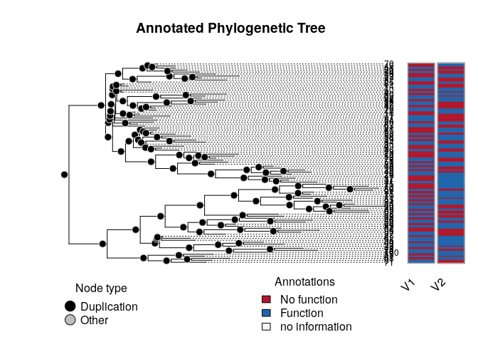
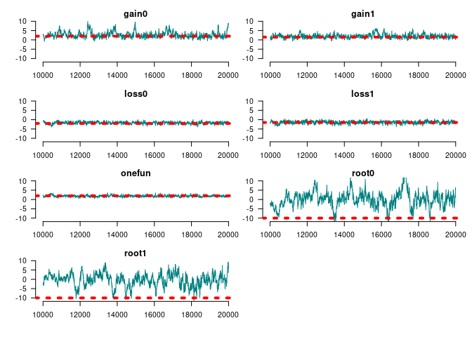
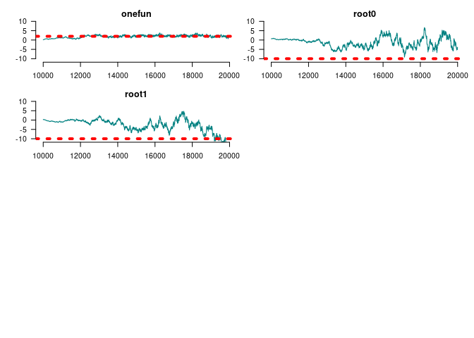
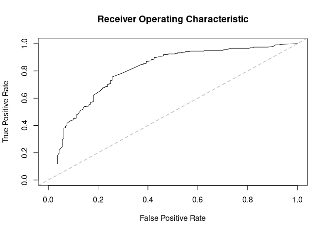
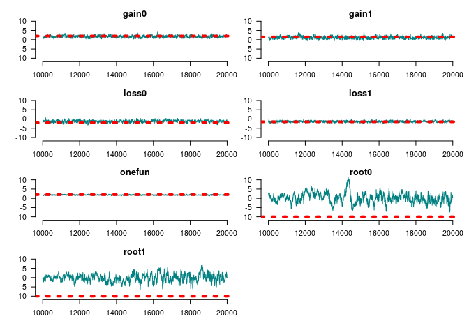
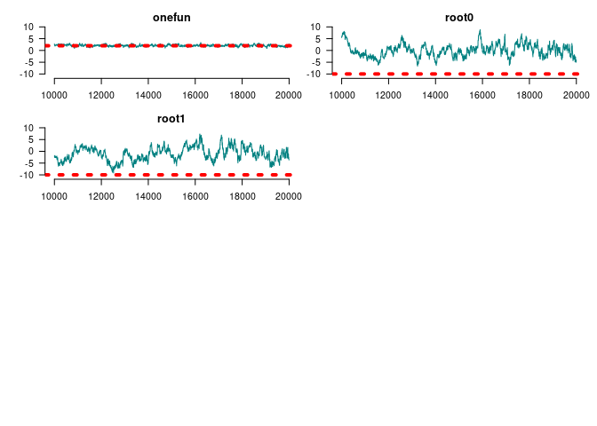
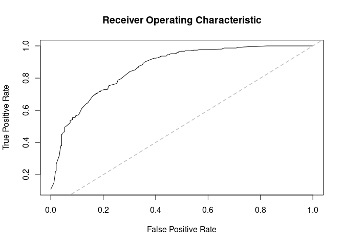

<!-- README.md is generated from README.Rmd. Please edit that file -->

<div>

[](https://image.usc.edu)

Integrative Methods of Analysis for Genetic Epidemiology

</div>

# geese: *GE*ne-functional *E*volution using *S*uffici*E*ncy 

<!-- badges: start -->

[](https://github.com/USCbiostats/geese/actions/workflows/R-CMD-check.yaml)
<!-- badges: end -->

This R package taps into statistical theory primarily developed in
social networks. Using Exponential-Family Random Graph Models (ERGMs),
`geese` provides a statistical framework for building Gene Functional
Evolution Models using Sufficiency. For example, users can directly
hypothesize whether Neofunctionalization or Subfunctionalization events
were taking place in a phylogeny, without having to estimate the full
transition Markov Matrix that is usually used.

GEESE is computationally efficient, with C++ under the hood, allowing
the analyses of either single trees (a GEESE) or multiple trees
simultaneously (pooled model) in a Flock.

This is a work in progress and based on the theoretical work developed
during [George G. Vega Yon](https://ggv.cl)’s doctoral thesis.

## Installation

<!-- You can install the released version of geese from [CRAN](https://CRAN.R-project.org) with: -->
<!-- ``` r -->
<!-- install.packages("geese") -->
<!-- ``` -->

The development version from [GitHub](https://github.com/) with:

``` r
# install.packages("devtools")
devtools::install_github("USCbiostats/geese")
```

# Examples

## Simulating annotations (two different sets)

``` r
library(geese)

# Preparing data
n <- 100L
annotations <- replicate(n * 2 - 1, c(9, 9), simplify = FALSE)

# Random tree
set.seed(31)
tree <- aphylo::sim_tree(n)$edge - 1L

# Sorting by the second column
tree <- tree[order(tree[, 2]), ]

duplication <- sample.int(
  n = 2, size = n * 2 - 1, replace = TRUE, prob = c(.4, .6)
  ) == 1

# Reading the data in
amodel <- new_geese(
  annotations = annotations,
  geneid = c(tree[, 2], n),
  parent = c(tree[, 1], -1),
  duplication = duplication
  )

# Preparing the model
term_gains(amodel, 0:1, duplication = 1)
term_loss(amodel, 0:1, duplication = 1)
term_gains(amodel, 0:1, duplication = 0)
term_loss(amodel, 0:1, duplication = 0)
term_maxfuns(amodel, 0, 1, duplication = 2)
init_model(amodel)
#> Initializing nodes in Geese (this could take a while)...
#> ||||||||||||||||||||||||||||||||||||||||||||||||||||||||||||||||||||||||| done.

# Testing
params <- c(
  # Gains spe
  2, 1.5,
  # Loss
  -2, -1.5,
  # Gains spe
  -2, -1,
  # Loss spe
  -4, -4,
  # Max funs
  2, 
  # Root probabilities
  -10, -10
)
names(params) <- c(
  "gain0 dupl", "gain1 dupl",
  "loss0 dupl", "loss1 dupl",
  "gain0 spe", "gain1 spe",
  "loss0 spe", "loss1 spe",
  "onefun", 
  "root0", "root1"
  )

likelihood(amodel, params*1) # Equals 1 b/c all missings
#> [1] 1

# Simulating data
fake1 <- sim_geese(p = amodel, par = params, seed = 212)
fake2 <- sim_geese(p = amodel, par = params)

# Removing interior node data
is_interior <- which(tree[,2] %in% tree[,1])
is_leaf     <- which(!tree[,2] %in% tree[,1])
# for (i in is_interior) {
#   fake1[[i]] <- rep(9, 2)
#   fake2[[i]] <- rep(9, 2)
# }
```

We can now visualize either of the annotations using the
[aphylo](https://github.com/USCbiostats/aphylo) package.

``` r
library(aphylo)
#> Loading required package: ape
ap <- aphylo_from_data_frame(
  tree        = as.phylo(tree), 
  annotations = data.frame(
    id = c(tree[, 2], n),
    do.call(rbind, fake1)
    )
)
plot(ap)
```



## Model fitting MLE

``` r
# Creating the object
# Creating the object
amodel <- new_geese(
  annotations = fake1,
  geneid      = c(tree[, 2], n),
  parent      = c(tree[, 1],-1),
  duplication = duplication
  )

# Adding the model terms
term_gains(amodel, 0:1, duplication = 1)
term_loss(amodel, 0:1, duplication = 1)
term_gains(amodel, 0:1, duplication = 0)
term_loss(amodel, 0:1, duplication = 0)
term_maxfuns(amodel, 0, 1, duplication = 2)
init_model(amodel)
#> Initializing nodes in Geese (this could take a while)...
#> ||||||||||||||||||||||||||||||||||||||||||||||||||||||||||||||||||||||||| done.

print(amodel)
#> GEESE
#> INFO ABOUT PHYLOGENY
#> # of functions           : 2
#> # of nodes [int; leaf]   : [99; 100]
#> # of ann. [zeros; ones]  : [83; 117]
#> # of events [dupl; spec] : [43; 56]
#> Largest polytomy         : 2
#> 
#> INFO ABOUT THE SUPPORT
#> Num. of Arrays       : 396
#> Support size         : 8
#> Support size range   : [1, 1]
#> Transform. Fun.      : no
#> Model terms (9)    :
#>  - Gains 0 at duplication
#>  - Gains 1 at duplication
#>  - Loss 0 at duplication
#>  - Loss 1 at duplication
#>  - Gains 0 at speciation
#>  - Gains 1 at speciation
#>  - Loss 0 at speciation
#>  - Loss 1 at speciation
#>  - Genes with [0, 1] funs

# Finding MLE
ans_mle <- geese_mle(amodel, hessian = TRUE, ncores = 4)
ans_mle
#> $par
#>  [1]  2.327179  1.553591 -1.729575 -1.833682 -1.590516 -1.119200 -3.823851
#>  [8] -2.864298  1.982499 -1.465843  4.366549
#> 
#> $value
#> [1] -109.7751
#> 
#> $counts
#> function gradient 
#>     1002       NA 
#> 
#> $convergence
#> [1] 1
#> 
#> $message
#> NULL
#> 
#> $hessian
#>               [,1]          [,2]          [,3]         [,4]          [,5]
#>  [1,] -4.206819071  0.5959524394  0.8862856191 -1.721987653 -1.503185e-01
#>  [2,]  0.595952439 -5.1501119636 -2.3668333888  2.589829846  2.739261e-02
#>  [3,]  0.886285619 -2.3668333888 -6.9892574608  1.273369396  9.894126e-03
#>  [4,] -1.721987653  2.5898298457  1.2733693957 -5.950797128 -3.604817e-02
#>  [5,] -0.150318497  0.0273926144  0.0098941264 -0.036048174 -1.372080e+00
#>  [6,]  0.020065546 -0.0867748664 -0.0605347044  0.373968106  4.557307e-02
#>  [7,]  0.238633328 -0.0203662864 -0.2858568173  0.088855117 -5.867635e-02
#>  [8,] -0.169421696  0.5298915990  0.1330584389 -0.704884567  2.255319e-01
#>  [9,]  2.314439286  4.1601766227 -3.0270645492 -5.257577271  6.883251e-01
#> [10,] -0.020862576 -0.0004507292 -0.0234848407  0.008509284  1.834480e-02
#> [11,]  0.000175195 -0.0036292338 -0.0001882725 -0.003219606  2.817835e-05
#>                [,6]         [,7]          [,8]          [,9]         [,10]
#>  [1,]  0.0200655457  0.238633328 -0.1694216962  2.314439e+00 -2.086258e-02
#>  [2,] -0.0867748664 -0.020366286  0.5298915990  4.160177e+00 -4.507292e-04
#>  [3,] -0.0605347044 -0.285856817  0.1330584389 -3.027065e+00 -2.348484e-02
#>  [4,]  0.3739681063  0.088855117 -0.7048845667 -5.257577e+00  8.509284e-03
#>  [5,]  0.0455730742 -0.058676354  0.2255319007  6.883251e-01  1.834480e-02
#>  [6,] -1.7555584648  0.187628157  0.5698203367  1.306991e+00  2.208491e-04
#>  [7,]  0.1876281566 -1.111934470  0.0777368676 -1.058568e+00 -1.325888e-02
#>  [8,]  0.5698203367  0.077736868 -2.5204264773 -2.774906e+00  7.558960e-03
#>  [9,]  1.3069908000 -1.058567779 -2.7749056741 -1.941377e+01 -1.233878e-02
#> [10,]  0.0002208491 -0.013258884  0.0075589597 -1.233878e-02 -6.093654e-03
#> [11,] -0.0005919283 -0.000109976  0.0001258655  4.454019e-04 -3.267786e-05
#>               [,11]
#>  [1,]  1.751950e-04
#>  [2,] -3.629234e-03
#>  [3,] -1.882725e-04
#>  [4,] -3.219606e-03
#>  [5,]  2.817835e-05
#>  [6,] -5.919283e-04
#>  [7,] -1.099760e-04
#>  [8,]  1.258655e-04
#>  [9,]  4.454019e-04
#> [10,] -3.267786e-05
#> [11,] -9.352519e-04

# Prob of each gene gaining a single function
transition_prob(
  amodel,
  params = rep(0, nterms(amodel) - nfuns(amodel)), 
  duplication = TRUE, state = c(FALSE, FALSE),
  array = matrix(c(1, 0, 0, 1), ncol=2)
)
#> [1] 0.0625
```

## Model fitting MCMC

``` r
set.seed(122)
ans_mcmc <- geese_mcmc(
  amodel,
  nsteps  = 20000,
  kernel  = fmcmc::kernel_ram(warmup = 5000), 
  prior   = function(p) c(
      dlogis(
        p,
        scale = 4,
        location = c(
          rep(0, nterms(amodel) - nfuns(amodel)),
          rep(-5, nfuns(amodel))
          ),
        log = TRUE
        )
  ), ncores = 2L)
```

We can take a look at the results like this:





    #> 
    #> Iterations = 15000:20000
    #> Thinning interval = 1 
    #> Number of chains = 1 
    #> Sample size per chain = 5001 
    #> 
    #> 1. Empirical mean and standard deviation for each variable,
    #>    plus standard error of the mean:
    #> 
    #>                            Mean     SD Naive SE Time-series SE
    #> Gains 0 at duplication   2.9015 0.8051 0.011385        0.09034
    #> Gains 1 at duplication   1.6914 0.5653 0.007994        0.04934
    #> Loss 0 at duplication   -2.0287 0.5349 0.007563        0.05280
    #> Loss 1 at duplication   -1.8866 0.6442 0.009110        0.08533
    #> Gains 0 at speciation  -12.1932 3.5435 0.050107        1.15176
    #> Gains 1 at speciation   -0.1454 0.6609 0.009345        0.06815
    #> Loss 0 at speciation    -2.9909 0.5184 0.007331        0.04458
    #> Loss 1 at speciation    -5.1655 1.9408 0.027444        0.39515
    #> Genes with [0, 1] funs   2.2578 0.4569 0.006461        0.06265
    #> Root 1                  -1.0470 3.0807 0.043564        0.94842
    #> Root 2                  -4.2756 4.2474 0.060061        1.59284
    #> 
    #> 2. Quantiles for each variable:
    #> 
    #>                            2.5%      25%      50%      75%   97.5%
    #> Gains 0 at duplication   1.4054   2.3030   2.8777   3.4337  4.5624
    #> Gains 1 at duplication   0.5451   1.3327   1.7001   2.0905  2.7559
    #> Loss 0 at duplication   -3.0657  -2.3764  -2.0460  -1.6762 -0.9765
    #> Loss 1 at duplication   -3.1944  -2.3389  -1.8797  -1.4119 -0.6868
    #> Gains 0 at speciation  -18.2113 -14.9130 -12.1597 -10.1648 -3.6030
    #> Gains 1 at speciation   -1.5472  -0.5998  -0.1365   0.3416  1.0736
    #> Loss 0 at speciation    -4.0181  -3.3470  -2.9738  -2.6539 -2.0354
    #> Loss 1 at speciation    -9.4815  -6.5157  -4.8115  -3.6121 -2.3045
    #> Genes with [0, 1] funs   1.4263   1.9483   2.2481   2.5599  3.2238
    #> Root 1                  -5.9435  -3.5719  -1.4757   1.4858  4.7924
    #> Root 2                 -14.2253  -5.9892  -3.8179  -1.5920  3.3555

``` r
par_estimates <- colMeans(
  window(ans_mcmc, start = end(ans_mcmc)*3/4)
  )
ans_pred <- predict_geese(
  amodel, par_estimates,
  leave_one_out = TRUE,
  only_annotated = TRUE
  ) |> do.call(what = "rbind")

# Preparing annotations
ann_obs <- do.call(rbind, fake1)

# AUC
(ans <- prediction_score(ans_pred, ann_obs))
#> Prediction score (H0: Observed = Random)
#> 
#>  N obs.      : 199
#>  alpha(0, 1) : 0.40, 0.60
#>  Observed    : 0.68 ***
#>  Random      : 0.52 
#>  P(<t)       : 0.0000
#> --------------------------------------------------------------------------------
#> Values scaled to range between 0 and 1, 1 being best.
#> 
#> Significance levels: *** p < .01, ** p < .05, * p < .10
#> AUC 0.80.
#> MAE 0.32.

plot(ans$auc, xlim = c(0,1), ylim = c(0,1))
```



## Using a flock

GEESE models can be grouped (pooled) into a flock.

``` r
flock <- new_flock()

# Adding first set of annotations
add_geese(
  flock,
  annotations = fake1,
  geneid      = c(tree[, 2], n),
  parent      = c(tree[, 1],-1),
  duplication = duplication  
)

# Now the second set
add_geese(
  flock,
  annotations = fake2,
  geneid      = c(tree[, 2], n),
  parent      = c(tree[, 1],-1),
  duplication = duplication  
)

# Persistence to preserve parent state
term_gains(flock, 0:1, duplication = 1)
term_loss(flock, 0:1, duplication = 1)
term_gains(flock, 0:1, duplication = 0)
term_loss(flock, 0:1, duplication = 0)
term_maxfuns(flock, 0, 1, duplication = 2)


# We need to initialize to do all the accountintg
init_model(flock)
#> Initializing nodes in Flock (this could take a while)...
#> ||||||||||||||||||||||||||||||||||||||||||||||||||||||||||||||||||||||||| done.

print(flock)
#> FLOCK (GROUP OF GEESE)
#> INFO ABOUT THE PHYLOGENIES
#> # of phylogenies         : 2
#> # of functions           : 2
#> # of ann. [zeros; ones]  : [165; 235]
#> # of events [dupl; spec] : [86; 112]
#> Largest polytomy         : 2
#> 
#> INFO ABOUT THE SUPPORT
#> Num. of Arrays       : 792
#> Support size         : 8
#> Support size range   : [1, 1]
#> Transform. Fun.      : no
#> Model terms (9)    :
#>  - Gains 0 at duplication
#>  - Gains 1 at duplication
#>  - Loss 0 at duplication
#>  - Loss 1 at duplication
#>  - Gains 0 at speciation
#>  - Gains 1 at speciation
#>  - Loss 0 at speciation
#>  - Loss 1 at speciation
#>  - Genes with [0, 1] funs
```

We can use the same program to fit the MCMC

``` r
set.seed(122)
ans_mcmc2 <- geese_mcmc(
  flock,
  nsteps  = 20000,
  kernel  = fmcmc::kernel_ram(warmup = 2000), 
  prior   = function(p) dlogis(p, scale = 2, log = TRUE),
  ncores  = 2
  )
```

``` r
op <- par(
  mfrow = c(4, 2), #tcl=.5,
  las=1, mar = c(3,3,1,0),
  bty = "n", oma = rep(1,4)
  )
for (i in 1:ncol(ans_mcmc2)) {
  tmpx <- window(ans_mcmc2, start = 10000)[,i,drop=FALSE]
  
  coda::traceplot(
    tmpx, smooth = FALSE, ylim = c(-11,11), col = rgb(0, 128, 128, maxColorValue = 255), 
    main = names(params)[i]
    )
  abline(h = params[i], lty=3, lwd=4, col = "red")
}
```



``` r
par(op)
```



``` r
summary(window(ans_mcmc2, start = 10000))
#> 
#> Iterations = 10000:20000
#> Thinning interval = 1 
#> Number of chains = 1 
#> Sample size per chain = 10001 
#> 
#> 1. Empirical mean and standard deviation for each variable,
#>    plus standard error of the mean:
#> 
#>                            Mean     SD Naive SE Time-series SE
#> Gains 0 at duplication  2.39204 0.4707 0.004707        0.03019
#> Gains 1 at duplication  1.85804 0.4925 0.004925        0.02789
#> Loss 0 at duplication  -2.15114 0.4451 0.004451        0.03310
#> Loss 1 at duplication  -1.50477 0.4427 0.004427        0.03176
#> Gains 0 at speciation  -4.10744 2.9954 0.029952        0.76564
#> Gains 1 at speciation  -0.84969 0.8242 0.008241        0.09520
#> Loss 0 at speciation   -3.16554 0.6535 0.006535        0.05307
#> Loss 1 at speciation   -4.88115 2.0161 0.020160        0.32971
#> Genes with [0, 1] funs  2.09933 0.3703 0.003702        0.02921
#> Root 1                  0.02501 2.6487 0.026486        0.45210
#> Root 2                 -1.07238 2.9197 0.029195        0.56841
#> 
#> 2. Quantiles for each variable:
#> 
#>                            2.5%    25%      50%     75%   97.5%
#> Gains 0 at duplication   1.5050  2.068  2.37614  2.7239  3.3368
#> Gains 1 at duplication   0.9237  1.511  1.84256  2.2029  2.8299
#> Loss 0 at duplication   -3.0413 -2.451 -2.14564 -1.8533 -1.2836
#> Loss 1 at duplication   -2.3961 -1.809 -1.51894 -1.1984 -0.6178
#> Gains 0 at speciation  -11.2547 -5.414 -2.91312 -1.9486 -0.9131
#> Gains 1 at speciation   -3.2320 -1.183 -0.72227 -0.3283  0.3280
#> Loss 0 at speciation    -4.7209 -3.510 -3.08984 -2.7347 -2.0557
#> Loss 1 at speciation   -10.5227 -5.326 -4.19469 -3.5823 -2.7532
#> Genes with [0, 1] funs   1.3738  1.842  2.07762  2.3515  2.8303
#> Root 1                  -4.7967 -1.873 -0.04377  1.5864  6.0565
#> Root 2                  -6.5355 -3.147 -1.08668  1.1586  4.6030
```

Are we doing better in AUCs?

``` r
par_estimates <- colMeans(
  window(ans_mcmc2, start = end(ans_mcmc2)*3/4)
  )

ans_pred <- predict_flock(
  flock, par_estimates,
  leave_one_out = TRUE,
  only_annotated = TRUE
  ) |>
  lapply(do.call, what = "rbind") |>
  do.call(what = rbind)

# Preparing annotations
ann_obs <- rbind(
  do.call(rbind, fake1),
  do.call(rbind, fake2)
)

# AUC
(ans <- prediction_score(ans_pred, ann_obs))
#> Prediction score (H0: Observed = Random)
#> 
#>  N obs.      : 398
#>  alpha(0, 1) : 0.42, 0.58
#>  Observed    : 0.72 ***
#>  Random      : 0.51 
#>  P(<t)       : 0.0000
#> --------------------------------------------------------------------------------
#> Values scaled to range between 0 and 1, 1 being best.
#> 
#> Significance levels: *** p < .01, ** p < .05, * p < .10
#> AUC 0.86.
#> MAE 0.28.
plot(ans$auc)
```



## Limiting the support

In this example, we use the function `rule_limit_changes()` to apply a
constraint to the support of the model. This takes the first two terms
(0 and 1 since the index is in C++) and restricts the support to states
where there are between $[0, 2]$ changes, at most.

This should be useful when dealing with multiple functions or
[pylotomies](https://en.wikipedia.org/wiki/Polytomy).

``` r
# Creating the object
amodel_limited <- new_geese(
  annotations = fake1,
  geneid      = c(tree[, 2], n),
  parent      = c(tree[, 1],-1),
  duplication = duplication
  )

# Adding the model terms
term_gains(amodel_limited, 0:1)
term_loss(amodel_limited, 0:1)
term_maxfuns(amodel_limited, 1, 1)
term_overall_changes(amodel_limited, TRUE)

# At most one gain
rule_limit_changes(amodel_limited, 5, 0, 2)

# We need to initialize to do all the accounting
init_model(amodel_limited)
#> Initializing nodes in Geese (this could take a while)...
#> ||||||||||||||||||||||||||||||||||||||||||||||||||||||||||||||||||||||||| done.

# Is limiting the support any useful?
support_size(amodel_limited)
#> [1] 31
```

Since we added the constraint based on the term
`term_overall_changes()`, we now need to fix the parameter at 0 (i.e.,
no effect) during the MCMC model:

``` r
set.seed(122)
ans_mcmc2 <- geese_mcmc(
  amodel_limited,
  nsteps  = 20000,
  kernel  = fmcmc::kernel_ram(
    warmup = 2000,
    fixed  = c(FALSE, FALSE, FALSE, FALSE, FALSE, TRUE, FALSE, FALSE)
    ), 
  prior   = function(p) dlogis(p, scale = 2, log = TRUE)
  )
```


    #> 
    #> Iterations = 15000:20000
    #> Thinning interval = 1 
    #> Number of chains = 1 
    #> Sample size per chain = 5001 
    #> 
    #> 1. Empirical mean and standard deviation for each variable,
    #>    plus standard error of the mean:
    #> 
    #>                                           Mean     SD Naive SE Time-series SE
    #> Gains 0 at duplication                 1.06329 0.8555 0.012097        0.06474
    #> Gains 1 at duplication                 1.00857 0.7727 0.010927        0.04945
    #> Loss 0 at duplication                 -1.44630 0.7529 0.010647        0.05664
    #> Loss 1 at duplication                 -0.65287 0.7342 0.010383        0.04529
    #> Genes with [1, 1] funs at duplication  1.04183 0.3736 0.005283        0.02301
    #> Overall changes at duplication         0.00000 0.0000 0.000000        0.00000
    #> Root 1                                -0.05519 3.1452 0.044476        0.35121
    #> Root 2                                -0.20215 3.2415 0.045837        0.41755
    #> 
    #> 2. Quantiles for each variable:
    #> 
    #>                                          2.5%     25%      50%     75%    97.5%
    #> Gains 0 at duplication                -0.5104  0.5096  1.07974  1.5870  2.75348
    #> Gains 1 at duplication                -0.3511  0.4883  0.97593  1.4741  2.72087
    #> Loss 0 at duplication                 -3.0046 -1.9420 -1.39766 -0.9289 -0.05484
    #> Loss 1 at duplication                 -2.0463 -1.1631 -0.65509 -0.2187  0.87313
    #> Genes with [1, 1] funs at duplication  0.3743  0.7911  1.01242  1.2674  1.88310
    #> Overall changes at duplication         0.0000  0.0000  0.00000  0.0000  0.00000
    #> Root 1                                -6.4868 -2.1595  0.08435  2.1941  5.72248
    #> Root 2                                -6.6845 -2.0668 -0.14747  1.7791  6.08394

# Code of Conduct

Please note that the aphylo2 project is released with a [Contributor
Code of
Conduct](https://contributor-covenant.org/version/2/0/CODE_OF_CONDUCT.html).
By contributing to this project, you agree to abide by its terms.
