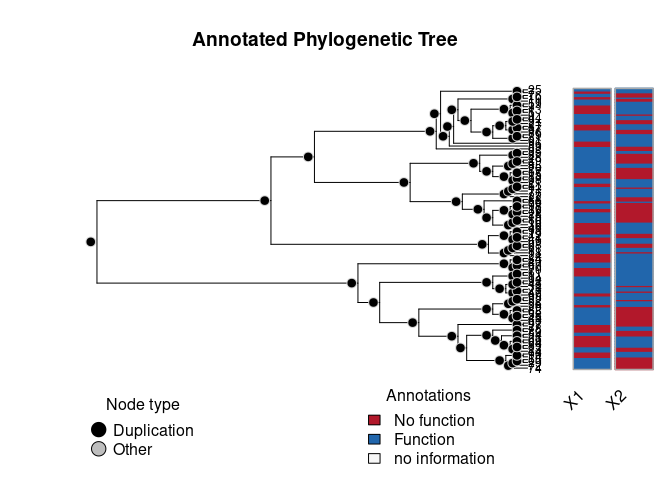

<!-- README.md is generated from README.Rmd. Please edit that file -->

[](https://image.usc.edu)

# geese: *GE*ne-functional *E*volution using *S*uffici*E*ncy 

<!-- badges: start -->

<!-- badges: end -->

This R package taps into statistical theory mostly developed in the
social networks realm. Using Exponential-Family Random Graph Models
(ERGMs), `geese` provides an statistical framework for building Gene
Functional Evolution Models using Sufficiency. For example, users can
directly hypothesize whether Neofunctionalization or
Subfunctionalization events were taking place in a phylogeny, without
having to estimate the full transition Markov Matrix that is usually
used.

GEESE is computationally efficient, with C++ under-the-hood, allowing
the analyses of either single trees (a GEESE) or multiple trees
simulatenously (pooled model), in a Flock.

This is work in progress and based on the theoretical work developed
duing [George G. Vega Yon](https://ggv.cl)’s doctoral thesis.

## Installation

<!-- You can install the released version of geese from [CRAN](https://CRAN.R-project.org) with: -->

<!-- ``` r -->

<!-- install.packages("geese") -->

<!-- ``` -->

The development version from [GitHub](https://github.com/) with:

``` r
# install.packages("devtools")
devtools::install_github("USCbiostats/geese")
```

# Examples

## Simulating annotations (two different sets)

``` r
library(geese)

# Preparing data
n <- 100L
annotations <- replicate(n * 2 - 1, c(9, 9), simplify = FALSE)

# Random tree
set.seed(31)
tree <- aphylo::sim_tree(n)$edge - 1L

duplication <- rep(TRUE, n * 2 - 1)

# Reading the data in
amodel <- new_geese(
  annotations = annotations,
  geneid = c(tree[, 2], n),
  parent = c(tree[, 1], -1),
  duplication = duplication
  )

# Preparing the model
term_gains(amodel, 0:1)
term_loss(amodel, 0:1)
term_maxfuns(amodel, 1, 1)
init_model(amodel)
#> Initializing nodes in Geese (this could take a while)...
#> ||||||||||||||||||||||||||||||||||||||||||||||||||||||||||||||||||||||||| done.

# Testing
params <- c(
  # Gains
  2, 1.5,
  # Loss
  -2, -1.5,
  # Max funs
  2, 
  # Root probabilities
  -10, -10
)
names(params) <- c("gain0", "gain1", "loss0", "loss1", "onefun", "root0", "root1")

likelihood(amodel, params*0) # Equals 1 b/c all missings
#> [1] 1

# Simulating data
fake1 <- sim_geese(p = amodel, par = params, seed = 1110)
fake2 <- sim_geese(p = amodel, par = params)
```

We can now visualize either of the annotations using the
[aphylo](https://github.com/USCbiostats/aphylo) package.

``` r
library(aphylo)
#> Loading required package: ape
ap <- aphylo_from_data_frame(
  tree        = as.phylo(tree), 
  annotations = data.frame(
    id = c(tree[, 2], n),
    do.call(rbind, fake1)
    )
)
plot(ap)
```



## Model fitting MLE

``` r
# Creating the object
amodel <- new_geese(
  annotations = fake1,
  geneid      = c(tree[, 2], n),
  parent      = c(tree[, 1],-1),
  duplication = duplication
  )

# Adding the model terms
term_gains(amodel, 0:1)
term_loss(amodel, 0:1)
term_maxfuns(amodel, 1, 1)

# We need to initialize to do all the accounting
init_model(amodel)
#> Initializing nodes in Geese (this could take a while)...
#> ||||||||||||||||||||||||||||||||||||||||||||||||||||||||||||||||||||||||| done.

print(amodel)
#> GEESE
#> INFO ABOUT PHYLOGENY
#> # of functions           : 2
#> # of nodes [int; leaf]   : [199; 100]
#> # of ann. [zeros; ones]  : [87; 113]
#> # of events [dupl; spec] : [99; 0]
#> Largest polytomy         : 2
#> 
#> INFO ABOUT THE SUPPORT
#> Num. of Arrays     : 396
#> Support size       : 4
#> Support size range : [0, 14]
#> Model terms (5)   :
#>  - Gains 0 at duplication
#>  - Gains 1 at duplication
#>  - Loss 0 at duplication
#>  - Loss 1 at duplication
#>  - Genes with [1, 1] funs at duplication

# Finding MLE
geese_mle(amodel, hessian = TRUE)
#> $par
#> [1]  1.3024291  1.4904183 -1.4668169 -0.9165704  1.8952822 -0.1918496 -0.5043625
#> 
#> $value
#> [1] -58.54824
#> 
#> $counts
#> function gradient 
#>      454       NA 
#> 
#> $convergence
#> [1] 0
#> 
#> $message
#> NULL
#> 
#> $hessian
#>               [,1]          [,2]          [,3]          [,4]          [,5]
#> [1,] -1.920339e+00  3.092661e-02  9.719647e-02 -5.826438e-01  1.230857e+00
#> [2,]  3.092661e-02 -2.155737e+00 -2.661554e-01  2.058254e+00  2.388066e+00
#> [3,]  9.719647e-02 -2.661554e-01 -1.562040e+00  1.126001e-01 -1.189657e+00
#> [4,] -5.826438e-01  2.058254e+00  1.126001e-01 -5.959471e+00 -3.427126e+00
#> [5,]  1.230857e+00  2.388066e+00 -1.189657e+00 -3.427126e+00 -2.441145e+01
#> [6,] -8.064660e-07  1.930012e-06 -1.188383e-06  3.367084e-06 -4.565237e-07
#> [7,]  6.355805e-06 -8.340431e-04  9.558576e-06 -6.562342e-04  1.888223e-04
#>               [,6]          [,7]
#> [1,] -8.064660e-07  6.355805e-06
#> [2,]  1.930012e-06 -8.340431e-04
#> [3,] -1.188383e-06  9.558576e-06
#> [4,]  3.367084e-06 -6.562342e-04
#> [5,] -4.565237e-07  1.888223e-04
#> [6,]  4.263256e-08  6.750156e-08
#> [7,]  6.750156e-08 -2.657963e-05

transition_prob(
  amodel,
  params = c(-1, -1, -2, -2, -.5), 
  duplication = TRUE, state = c(FALSE, FALSE),
  array = matrix(c(1, 0, 0, 1)*0, ncol=2)
)
#> [1] 0.2315802
```

## Model fitting MCMC

``` r
set.seed(122)
ans_mcmc <- geese_mcmc(
  amodel,
  nsteps  = 20000,
  kernel  = fmcmc::kernel_ram(warmup = 2000), 
  prior   = function(p) dlogis(p, scale = 2, log = TRUE)
  )
#> 
#> |0%                 |25%                |50%                |75%           100%|
#> --------------------------------------------------------------------------------
#> ////////////////////////////////////////////////////////////////////////////////
```

We can take a look at the results like this:


    #> 
    #> Iterations = 15000:20000
    #> Thinning interval = 1 
    #> Number of chains = 1 
    #> Sample size per chain = 5001 
    #> 
    #> 1. Empirical mean and standard deviation for each variable,
    #>    plus standard error of the mean:
    #> 
    #>                                          Mean     SD Naive SE Time-series SE
    #> Gains 0 at duplication                 1.2723 0.7586 0.010727        0.05294
    #> Gains 1 at duplication                 1.8373 0.9848 0.013926        0.07326
    #> Loss 0 at duplication                 -1.4241 0.8064 0.011403        0.05438
    #> Loss 1 at duplication                 -0.8163 0.5572 0.007879        0.03446
    #> Genes with [1, 1] funs at duplication  1.9937 0.2215 0.003132        0.01277
    #> Root 1                                 0.3445 2.9532 0.041761        0.31086
    #> Root 2                                -0.3347 3.0158 0.042645        0.33184
    #> 
    #> 2. Quantiles for each variable:
    #> 
    #>                                          2.5%     25%     50%     75%   97.5%
    #> Gains 0 at duplication                -0.1466  0.7817  1.2424  1.7714 2.73773
    #> Gains 1 at duplication                 0.2052  1.1583  1.7674  2.4307 3.76635
    #> Loss 0 at duplication                 -3.0947 -1.9784 -1.4155 -0.8769 0.06948
    #> Loss 1 at duplication                 -1.8223 -1.1907 -0.8697 -0.4792 0.39775
    #> Genes with [1, 1] funs at duplication  1.6037  1.8319  1.9926  2.1413 2.42520
    #> Root 1                                -4.9226 -1.7294  0.2676  2.0521 6.89956
    #> Root 2                                -6.3861 -2.1793 -0.2905  1.6815 5.45537

``` r
# Obtaining estimates
par_estimates <- colMeans(window(ans_mcmc, start = 20000))
ans_pred      <- predict_geese(amodel, par_estimates, leave_one_out = TRUE)
ans_pred      <- do.call(rbind, ans_pred)

# Preparing annotations
ann_obs <- do.call(rbind, fake1)

# Mean Absolute Error
hist(abs(ans_pred - ann_obs))
```


``` r

# AUC
(ans <- aphylo::prediction_score(
  cbind(as.vector(ans_pred)),
  cbind(as.vector(ann_obs))
  ))
#> Prediction score (H0: Observed = Random)
#> 
#>  N obs.      : 398
#>  alpha(0, 1) : 0.42, 0.58
#>  Observed    : 0.81 ***
#>  Random      : 0.51 
#>  P(<t)       : 0.0000
#> --------------------------------------------------------------------------------
#> Values scaled to range between 0 and 1, 1 being best.
#> 
#> Significance levels: *** p < .01, ** p < .05, * p < .10
#> AUC 0.93.
#> MAE 0.19.
plot(ans$auc)
```


## Using a flock

GEESE models can be grouped (pooled) into a flock.

``` r
flock <- new_flock()

# Adding first set of annotations
add_geese(
  flock,
  annotations = fake1,
  geneid      = c(tree[, 2], n),
  parent      = c(tree[, 1],-1),
  duplication = duplication  
)

# Now the second set
add_geese(
  flock,
  annotations = fake2,
  geneid      = c(tree[, 2], n),
  parent      = c(tree[, 1],-1),
  duplication = duplication  
)

# Adding the model terms
term_gains(flock, 0:1)
term_loss(flock, 0:1)
term_maxfuns(flock, 1, 1)

# We need to initialize to do all the accountintg
init_model(flock)
#> Initializing nodes in Geese (this could take a while)...
#> ||||||||||||||||||||||||||||||||||||||||||||||||||||||||||||||||||||||||| done.
#> Initializing nodes in Geese (this could take a while)...
#> ||||||||||||||||||||||||||||||||||||||||||||||||||||||||||||||||||||||||| done.

print(flock)
#> FLOCK (GROUP OF GEESE)
#> INFO ABOUT THE PHYLOGENIES
#> # of phylogenies         : 2
#> # of functions           : 2
#> # of ann. [zeros; ones]  : [166; 234]
#> # of events [dupl; spec] : [198; 0]
#> Largest polytomy         : 2
#> 
#> INFO ABOUT THE SUPPORT
#> Num. of Arrays     : 792
#> Support size       : 4
#> Support size range : [0, 14]
#> Model terms (5)   :
#>  - Gains 0 at duplication
#>  - Gains 1 at duplication
#>  - Loss 0 at duplication
#>  - Loss 1 at duplication
#>  - Genes with [1, 1] funs at duplication
```

We can use the same program to fit the MCMC

``` r
set.seed(122)
ans_mcmc2 <- geese_mcmc(
  flock,
  nsteps  = 20000,
  kernel  = fmcmc::kernel_ram(warmup = 2000), 
  prior   = function(p) dlogis(p, scale = 2, log = TRUE)
  )
```

``` r
op <- par(
  mfrow = c(4, 2), #tcl=.5,
  las=1, mar = c(3,3,1,0),
  bty = "n", oma = rep(1,4)
  )
for (i in 1:ncol(ans_mcmc2)) {
  tmpx <- window(ans_mcmc2, start = 10000)[,i,drop=FALSE]
  
  coda::traceplot(
    tmpx, smooth = FALSE, ylim = c(-11,11), col = rgb(0, 128, 128, maxColorValue = 255), 
    main = names(params)[i]
    )
  abline(h = params[i], lty=3, lwd=4, col = "red")
}
par(op)
```


``` r
summary(window(ans_mcmc2, start = 10000))
#> 
#> Iterations = 10000:20000
#> Thinning interval = 1 
#> Number of chains = 1 
#> Sample size per chain = 10001 
#> 
#> 1. Empirical mean and standard deviation for each variable,
#>    plus standard error of the mean:
#> 
#>          Mean     SD Naive SE Time-series SE
#> par1  1.75029 0.5658 0.005658       0.031031
#> par2  1.15245 0.6418 0.006418       0.031898
#> par3 -1.27191 0.5489 0.005488       0.026757
#> par4 -1.37351 0.3635 0.003635       0.015714
#> par5  1.81130 0.1630 0.001630       0.007164
#> par6  0.20264 2.6196 0.026195       0.304291
#> par7 -0.09525 1.9988 0.019987       0.192587
#> 
#> 2. Quantiles for each variable:
#> 
#>          2.5%     25%     50%     75%   97.5%
#> par1  0.72459  1.3498  1.7308  2.1272  2.8592
#> par2  0.03824  0.7103  1.1054  1.5305  2.5470
#> par3 -2.37365 -1.6300 -1.2692 -0.9166 -0.1438
#> par4 -2.09160 -1.6242 -1.3736 -1.1207 -0.6764
#> par5  1.49584  1.6992  1.8025  1.9109  2.1439
#> par6 -4.78636 -1.4981  0.1150  1.8273  5.1856
#> par7 -4.12554 -1.3982 -0.1091  1.1896  4.0561
```

## Limiting the support

In this example, we use the function `rule_limit_changes()` to apply a
constraint to the support of the model. This takes the 6th term (5th
since the index is in C++), and restricts the support to states where
there are between \([0, 2]\) changes, at most.

This should be useful when dealing with multiple functions or
[pylotomies](https://en.wikipedia.org/wiki/Polytomy).

``` r
# Creating the object
amodel_limited <- new_geese(
  annotations = fake1,
  geneid      = c(tree[, 2], n),
  parent      = c(tree[, 1],-1),
  duplication = duplication
  )

# Adding the model terms
term_gains(amodel_limited, 0:1)
term_loss(amodel_limited, 0:1)
term_maxfuns(amodel_limited, 1, 1)
term_overall_changes(amodel_limited, TRUE)

# At most one gain
rule_limit_changes(amodel_limited, 5, 0, 2)


# We need to initialize to do all the accounting
init_model(amodel_limited)
#> Initializing nodes in Geese (this could take a while)...
#> ||||||||||||||||||||||||||||||||||||||||||||||||||||||||||||||||||||||||| done.

# Is limiting the support any useful?
support_size(amodel_limited)
#> [1] 38
```

Since we added the constraint based on the term
`term_overall_changes()`, we now need to fix the parameter at 0 (i.e. no
effect) during the MCMC model:

``` r
set.seed(122)
ans_mcmc2 <- geese_mcmc(
  amodel_limited,
  nsteps  = 20000,
  kernel  = fmcmc::kernel_ram(
    warmup = 2000,
    fixed  = c(FALSE, FALSE, FALSE, FALSE, FALSE, TRUE, FALSE, FALSE)
    ), 
  prior   = function(p) dlogis(p, scale = 2, log = TRUE)
  )
```


    #> 
    #> Iterations = 15000:20000
    #> Thinning interval = 1 
    #> Number of chains = 1 
    #> Sample size per chain = 5001 
    #> 
    #> 1. Empirical mean and standard deviation for each variable,
    #>    plus standard error of the mean:
    #> 
    #>         Mean     SD Naive SE Time-series SE
    #> par1  1.5978 0.7201 0.010182        0.04988
    #> par2  0.2838 0.6662 0.009421        0.04107
    #> par3 -0.5430 0.7374 0.010428        0.04801
    #> par4 -1.6198 0.4177 0.005906        0.02535
    #> par5  1.5778 0.2493 0.003525        0.01590
    #> par6  0.0000 0.0000 0.000000        0.00000
    #> par7  0.9949 4.0323 0.057019        0.68642
    #> par8  0.2408 4.1023 0.058010        0.78150
    #> 
    #> 2. Quantiles for each variable:
    #> 
    #>         2.5%     25%     50%      75%   97.5%
    #> par1  0.2735  1.0748  1.6196  2.08840  3.0638
    #> par2 -1.0489 -0.1436  0.2981  0.70806  1.6241
    #> par3 -1.9553 -1.0994 -0.5369 -0.03162  0.9411
    #> par4 -2.4332 -1.9108 -1.6239 -1.35157 -0.7724
    #> par5  1.1535  1.3999  1.5442  1.72195  2.1680
    #> par6  0.0000  0.0000  0.0000  0.00000  0.0000
    #> par7 -5.9244 -1.3063  0.4356  2.95659 11.2694
    #> par8 -9.3450 -2.1194  0.1551  2.63111  8.7294

# Code of Conduct

Please note that the aphylo2 project is released with a [Contributor
Code of
Conduct](https://contributor-covenant.org/version/2/0/CODE_OF_CONDUCT.html).
By contributing to this project, you agree to abide by its terms.
