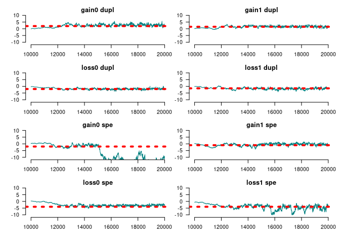

<!-- README.md is generated from README.Rmd. Please edit that file -->

<div>

[](https://image.usc.edu)

Integrative Methods of Analysis for Genetic Epidemiology

</div>

# geese: *GE*ne-functional *E*volution using *S*uffici*E*ncy 

<!-- badges: start -->

[](https://github.com/USCbiostats/geese/actions/workflows/R-CMD-check.yaml)
<!-- badges: end -->

This R package taps into statistical theory mostly developed in the
social networks realm. Using Exponential-Family Random Graph Models
(ERGMs), `geese` provides an statistical framework for building Gene
Functional Evolution Models using Sufficiency. For example, users can
directly hypothesize whether Neofunctionalization or
Subfunctionalization events were taking place in a phylogeny, without
having to estimate the full transition Markov Matrix that is usually
used.

GEESE is computationally efficient, with C++ under-the-hood, allowing
the analyses of either single trees (a GEESE) or multiple trees
simulatenously (pooled model), in a Flock.

This is work in progress and based on the theoretical work developed
duing [George G. Vega Yon](https://ggv.cl)’s doctoral thesis.

## Installation

<!-- You can install the released version of geese from [CRAN](https://CRAN.R-project.org) with: -->
<!-- ``` r -->
<!-- install.packages("geese") -->
<!-- ``` -->

The development version from [GitHub](https://github.com/) with:

``` r
# install.packages("devtools")
devtools::install_github("USCbiostats/geese")
```

# Examples

## Simulating annotations (two different sets)

``` r
library(geese)

# Preparing data
n <- 100L
annotations <- replicate(n * 2 - 1, c(9, 9), simplify = FALSE)

# Random tree
set.seed(31)
tree <- aphylo::sim_tree(n)$edge - 1L

duplication <- rep(TRUE, n * 2 - 1)

# Reading the data in
amodel <- new_geese(
  annotations = annotations,
  geneid = c(tree[, 2], n),
  parent = c(tree[, 1], -1),
  duplication = duplication
  )

# Preparing the model
term_gains(amodel, 0:1)
term_loss(amodel, 0:1)
term_maxfuns(amodel, 1, 1)
init_model(amodel)
#> Initializing nodes in Geese (this could take a while)...
#> ||||||||||||||||||||||||||||||||||||||||||||||||||||||||||||||||||||||||| done.

# Testing
params <- c(
  # Gains
  2, 1.5,
  # Loss
  -2, -1.5,
  # Max funs
  2, 
  # Root probabilities
  -10, -10
)
names(params) <- c("gain0", "gain1", "loss0", "loss1", "onefun", "root0", "root1")

likelihood(amodel, params*0) # Equals 1 b/c all missings
#> [1] 1

# Simulating data
fake1 <- sim_geese(p = amodel, par = params, seed = 1110)
fake2 <- sim_geese(p = amodel, par = params)
```

We can now visualize either of the annotations using the
[aphylo](https://github.com/USCbiostats/aphylo) package.

``` r
library(aphylo)
#> Loading required package: ape
ap <- aphylo_from_data_frame(
  tree        = as.phylo(tree), 
  annotations = data.frame(
    id = c(tree[, 2], n),
    do.call(rbind, fake1)
    )
)
plot(ap)
```


## Model fitting MLE

``` r
# Creating the object
# Creating the object
amodel <- new_geese(
  annotations = fake1,
  geneid      = c(tree[, 2], n),
  parent      = c(tree[, 1],-1),
  duplication = duplication
  )

# Adding the model terms
term_gains(amodel, 0:1)
term_loss(amodel, 0:1)
term_maxfuns(amodel, 1, 1)

# We need to initialize to do all the accounting
init_model(amodel)
#> Initializing nodes in Geese (this could take a while)...
#> ||||||||||||||||||||||||||||||||||||||||||||||||||||||||||||||||||||||||| done.

print(amodel)
#> GEESE
#> INFO ABOUT PHYLOGENY
#> # of functions           : 2
#> # of nodes [int; leaf]   : [99; 100]
#> # of ann. [zeros; ones]  : [72; 128]
#> # of events [dupl; spec] : [99; 0]
#> Largest polytomy         : 2
#> 
#> INFO ABOUT THE SUPPORT
#> Num. of Arrays       : 396
#> Support size         : 4
#> Support size range   : [10, 10]
#> Transform. Fun.      : no
#> Model terms (5)    :
#>  - Gains 0 at duplication
#>  - Gains 1 at duplication
#>  - Loss 0 at duplication
#>  - Loss 1 at duplication
#>  - Genes with [1, 1] funs at duplication

# Finding MLE
ans_mle <- geese_mle(amodel, hessian = TRUE)

# Prob of each gene gaining a single function
transition_prob(
  amodel,
  params = c(-1, -1, -2, -2, -.5), 
  duplication = TRUE, state = c(FALSE, FALSE),
  array = matrix(c(1, 0, 0, 1), ncol=2)
)
#> [1] 0.01990333
```

## Model fitting MCMC

``` r
set.seed(122)
ans_mcmc <- geese_mcmc(
  amodel,
  nsteps  = 20000,
  kernel  = fmcmc::kernel_ram(warmup = 2000), 
  prior   = function(p) dlogis(p, scale = 2, log = TRUE)
  )
```

We can take a look at the results like this:



    #> 
    #> Iterations = 15000:20000
    #> Thinning interval = 1 
    #> Number of chains = 1 
    #> Sample size per chain = 5001 
    #> 
    #> 1. Empirical mean and standard deviation for each variable,
    #>    plus standard error of the mean:
    #> 
    #>                                          Mean     SD Naive SE Time-series SE
    #> Gains 0 at duplication                 2.5163 1.5272 0.021595        0.17972
    #> Gains 1 at duplication                 2.0925 1.2076 0.017077        0.13709
    #> Loss 0 at duplication                 -1.7518 0.6079 0.008596        0.05062
    #> Loss 1 at duplication                 -1.4358 0.6546 0.009257        0.04587
    #> Genes with [1, 1] funs at duplication  1.8845 0.4698 0.006643        0.03823
    #> Root 1                                 0.2000 4.5845 0.064828        0.84884
    #> Root 2                                -0.4791 3.3166 0.046900        0.49277
    #> 
    #> 2. Quantiles for each variable:
    #> 
    #>                                          2.5%    25%      50%    75%   97.5%
    #> Gains 0 at duplication                 0.3490  1.484  2.22730  3.187  6.9267
    #> Gains 1 at duplication                 0.3154  1.258  1.89930  2.630  5.2817
    #> Loss 0 at duplication                 -2.9349 -2.191 -1.72650 -1.306 -0.6860
    #> Loss 1 at duplication                 -2.7509 -1.892 -1.44436 -0.984 -0.1482
    #> Genes with [1, 1] funs at duplication  1.0690  1.534  1.86367  2.195  2.8358
    #> Root 1                                -8.7570 -2.336  0.03266  2.579 10.9341
    #> Root 2                                -6.9796 -2.679 -0.45639  1.848  5.8369

``` r
par_estimates <- colMeans(window(ans_mcmc, start = 20000))
ans_pred      <- predict_geese(amodel, par_estimates, leave_one_out = TRUE)
ans_pred      <- do.call(rbind, ans_pred)

# Preparing annotations
ann_obs <- do.call(rbind, fake1)

# Mean Absolute Error
hist(abs(ans_pred - ann_obs))
```


``` r

# AUC
(ans <- aphylo::prediction_score(
  cbind(as.vector(ans_pred)),
  cbind(as.vector(ann_obs))
  ))
#> Prediction score (H0: Observed = Random)
#> 
#>  N obs.      : 398
#>  alpha(0, 1) : 0.37, 0.63
#>  Observed    : 0.55 
#>  Random      : 0.53 
#>  P(<t)       : 0.2869
#> --------------------------------------------------------------------------------
#> Values scaled to range between 0 and 1, 1 being best.
#> 
#> Significance levels: *** p < .01, ** p < .05, * p < .10
#> AUC 0.51.
#> MAE 0.45.

plot(ans$auc)
```


<!-- We can compare these results to what we would obtain using aphylo -->
<!-- # ```{r aphylo} -->
<!-- # ans_aphylo <- aphylo_mcmc(ap ~ mu_d + mu_s + Pi) -->
<!-- # (ps <- prediction_score(ans_aphylo)) -->
<!-- # ``` -->

## Using a flock

GEESE models can be grouped (pooled) into a flock.

``` r
flock <- new_flock()

# Adding first set of annotations
add_geese(
  flock,
  annotations = fake1,
  geneid      = c(tree[, 2], n),
  parent      = c(tree[, 1],-1),
  duplication = duplication  
)

# Now the second set
add_geese(
  flock,
  annotations = fake2,
  geneid      = c(tree[, 2], n),
  parent      = c(tree[, 1],-1),
  duplication = duplication  
)

# Persistence to preserve parent state
term_gains(flock, 0:1, duplication = 1)
term_gains(flock, 0:1, duplication = 1)
term_maxfuns(flock, 1, 1, duplication = 1)

# We need to initialize to do all the accountintg
init_model(flock)
#> Initializing nodes in Flock (this could take a while)...
#> ||||||||||||||||||||||||||||||||||||||||||||||||||||||||||||||||||||||||| done.

print(flock)
#> FLOCK (GROUP OF GEESE)
#> INFO ABOUT THE PHYLOGENIES
#> # of phylogenies         : 2
#> # of functions           : 2
#> # of ann. [zeros; ones]  : [145; 255]
#> # of events [dupl; spec] : [198; 0]
#> Largest polytomy         : 2
#> 
#> INFO ABOUT THE SUPPORT
#> Num. of Arrays       : 792
#> Support size         : 4
#> Support size range   : [3, 10]
#> Transform. Fun.      : no
#> Model terms (5)    :
#>  - Gains 0 at duplication
#>  - Gains 1 at duplication
#>  - Gains 0 at duplication
#>  - Gains 1 at duplication
#>  - Genes with [1, 1] funs at duplication
```

We can use the same program to fit the MCMC

``` r
set.seed(122)
ans_mcmc2 <- geese_mcmc(
  flock,
  nsteps  = 20000,
  kernel  = fmcmc::kernel_ram(warmup = 2000), 
  prior   = function(p) dlogis(p, scale = 2, log = TRUE)
  )
```

``` r
op <- par(
  mfrow = c(4, 2), #tcl=.5,
  las=1, mar = c(3,3,1,0),
  bty = "n", oma = rep(1,4)
  )
for (i in 1:ncol(ans_mcmc2)) {
  tmpx <- window(ans_mcmc2, start = 10000)[,i,drop=FALSE]
  
  coda::traceplot(
    tmpx, smooth = FALSE, ylim = c(-11,11), col = rgb(0, 128, 128, maxColorValue = 255), 
    main = names(params)[i]
    )
  abline(h = params[i], lty=3, lwd=4, col = "red")
}
par(op)
```


``` r
summary(window(ans_mcmc2, start = 10000))
#> 
#> Iterations = 10000:20000
#> Thinning interval = 1 
#> Number of chains = 1 
#> Sample size per chain = 10001 
#> 
#> 1. Empirical mean and standard deviation for each variable,
#>    plus standard error of the mean:
#> 
#>                                         Mean     SD Naive SE Time-series SE
#> Gains 0 at duplication                1.2650 2.2088 0.022087       0.222041
#> Gains 1 at duplication                0.6656 2.5350 0.025348       0.445193
#> Gains 0 at duplication                1.5533 2.3386 0.023385       0.333928
#> Gains 1 at duplication                0.6474 2.5415 0.025414       0.394829
#> Genes with [1, 1] funs at duplication 0.8878 0.1446 0.001446       0.004478
#> Root 1                                0.5259 3.5929 0.035927       0.363434
#> Root 2                                0.1195 3.6405 0.036403       0.413736
#> 
#> 2. Quantiles for each variable:
#> 
#>                                          2.5%      25%      50%    75% 97.5%
#> Gains 0 at duplication                -3.3453 -0.16720  1.28576 2.7768 5.455
#> Gains 1 at duplication                -4.5441 -1.03143  0.92544 2.4571 5.112
#> Gains 0 at duplication                -2.4602 -0.07041  1.44898 2.8152 6.893
#> Gains 1 at duplication                -3.9060 -1.09242  0.33373 2.3327 5.772
#> Genes with [1, 1] funs at duplication  0.6098  0.78839  0.89160 0.9865 1.166
#> Root 1                                -7.0003 -1.66898  0.41966 2.6846 8.177
#> Root 2                                -7.0876 -2.23377 -0.03671 2.3143 7.521
```

## Limiting the support

In this example, we use the function `rule_limit_changes()` to apply a
constraint to the support of the model. This takes the first 2 term (0
and 1 since the index is in C++), and restricts the support to states
where there are between $[0, 2]$ changes, at most.

This should be useful when dealing with multiple functions or
[pylotomies](https://en.wikipedia.org/wiki/Polytomy).

``` r
# Creating the object
amodel_limited <- new_geese(
  annotations = fake1,
  geneid      = c(tree[, 2], n),
  parent      = c(tree[, 1],-1),
  duplication = duplication
  )

# Adding the model terms
term_gains(amodel_limited, 0:1)
term_loss(amodel_limited, 0:1)
term_maxfuns(amodel_limited, 1, 1)
term_overall_changes(amodel_limited, TRUE)

# At most one gain
rule_limit_changes(amodel_limited, 5, 0, 2)

# We need to initialize to do all the accounting
init_model(amodel_limited)
#> Initializing nodes in Geese (this could take a while)...
#> ||||||||||||||||||||||||||||||||||||||||||||||||||||||||||||||||||||||||| done.

# Is limiting the support any useful?
support_size(amodel_limited)
#> [1] 196
```

Since we added the constraint based on the term
`term_overall_changes()`, we now need to fix the parameter at 0 (i.e. no
effect) during the MCMC model:

``` r
set.seed(122)
ans_mcmc2 <- geese_mcmc(
  amodel_limited,
  nsteps  = 20000,
  kernel  = fmcmc::kernel_ram(
    warmup = 2000,
    fixed  = c(FALSE, FALSE, FALSE, FALSE, FALSE, TRUE, FALSE, FALSE)
    ), 
  prior   = function(p) dlogis(p, scale = 2, log = TRUE)
  )
```


    #> 
    #> Iterations = 15000:20000
    #> Thinning interval = 1 
    #> Number of chains = 1 
    #> Sample size per chain = 5001 
    #> 
    #> 1. Empirical mean and standard deviation for each variable,
    #>    plus standard error of the mean:
    #> 
    #>                                          Mean     SD Naive SE Time-series SE
    #> Gains 0 at duplication                 1.4575 0.6083 0.008602        0.04453
    #> Gains 1 at duplication                 1.1337 0.6868 0.009711        0.05444
    #> Loss 0 at duplication                 -1.8499 0.4843 0.006849        0.04207
    #> Loss 1 at duplication                 -1.7043 0.4894 0.006920        0.03454
    #> Genes with [1, 1] funs at duplication  1.6845 0.4270 0.006038        0.03512
    #> Overall changes at duplication         0.0000 0.0000 0.000000        0.00000
    #> Root 1                                -0.4058 4.0884 0.057813        0.76638
    #> Root 2                                 0.4454 3.8899 0.055006        0.78296
    #> 
    #> 2. Quantiles for each variable:
    #> 
    #>                                            2.5%     25%      50%    75%   97.5%
    #> Gains 0 at duplication                  0.40725  1.0206  1.42499  1.832  2.8323
    #> Gains 1 at duplication                 -0.04293  0.6465  1.09431  1.593  2.6107
    #> Loss 0 at duplication                  -2.81021 -2.1509 -1.82709 -1.512 -0.9524
    #> Loss 1 at duplication                  -2.65462 -1.9963 -1.68462 -1.377 -0.8145
    #> Genes with [1, 1] funs at duplication   0.93538  1.3850  1.65966  1.936  2.6215
    #> Overall changes at duplication          0.00000  0.0000  0.00000  0.000  0.0000
    #> Root 1                                -10.37064 -2.6885 -0.09387  2.250  6.7433
    #> Root 2                                 -6.89559 -1.9881  0.26227  2.743  9.1986

# Code of Conduct

Please note that the aphylo2 project is released with a [Contributor
Code of
Conduct](https://contributor-covenant.org/version/2/0/CODE_OF_CONDUCT.html).
By contributing to this project, you agree to abide by its terms.
